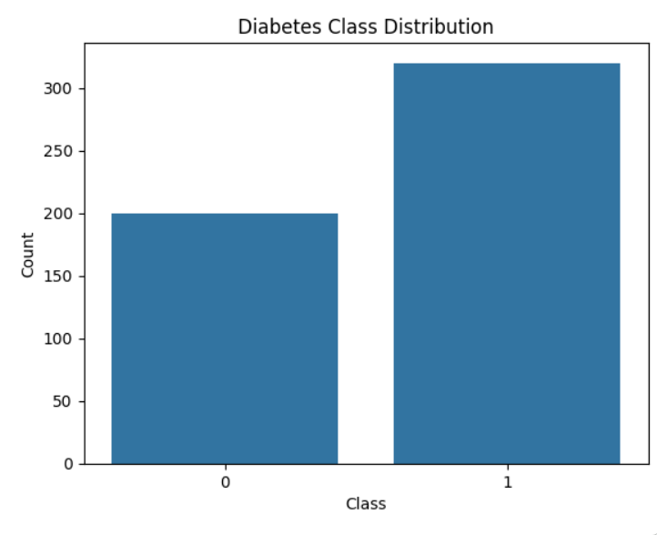
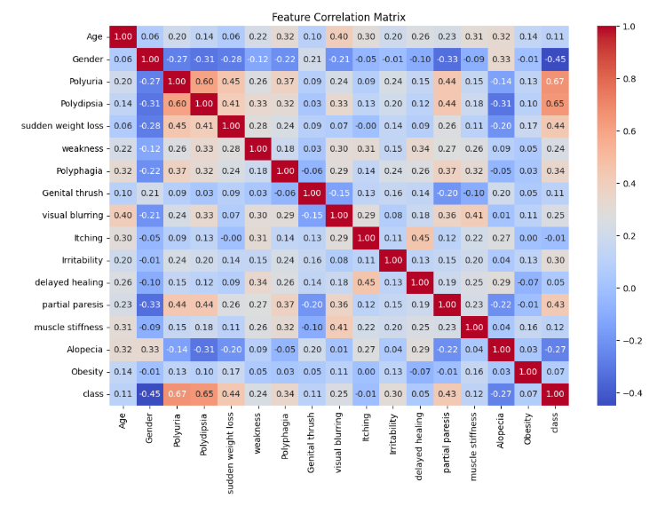
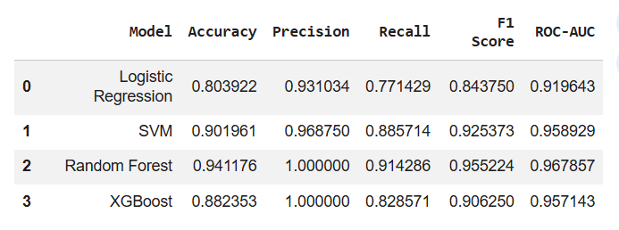
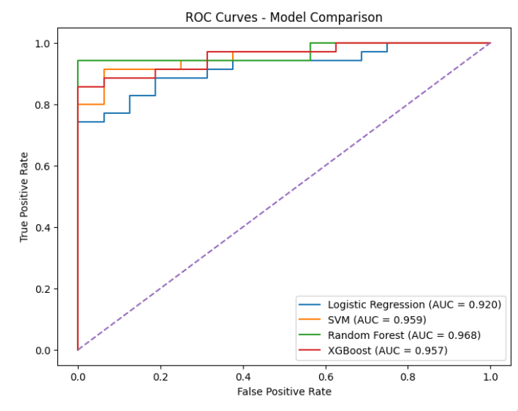
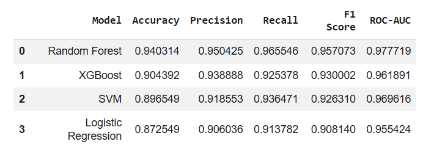
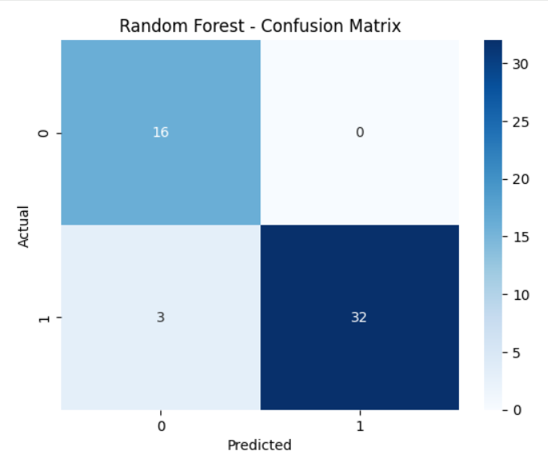

# Diabetes Prediction from Medical Data

  <b>A Machine Learning classification project for predicting the possibility of diabetes from patient demographic data and medical symptoms.</b>

---

## Project Overview

This project focuses on building a Machine Learning classification system that predicts the possibility of diabetes based on patient demographic information and diabetes-related symptoms.

The project follows an end-to-end Machine Learning workflow, including Exploratory Data Analysis, data preprocessing, model training, model comparison, evaluation, Cross-Validation, and final model selection.

> **Disclaimer:** This project is developed for educational and Machine Learning purposes. The predictions generated by the model should not be considered a medical diagnosis.

---

## Exploratory Data Analysis

Before training the models, Exploratory Data Analysis (EDA) was performed to understand the dataset, identify patterns, and examine relationships between the features and the target variable.

The analysis included:

- Dataset structure and data types
- Statistical analysis
- Missing value checking
- Duplicate detection and removal
- Class distribution
- Feature correlation analysis
- Relationship between symptoms and the target variable

### Class Distribution

  

The dataset contains two target classes:

- `0` → Negative
- `1` → Positive

The class distribution shows that the dataset contains more positive cases than negative cases.

---

### Feature Correlation

  

The correlation matrix shows the relationships between the different features and the target variable.

Some symptoms, particularly **Polyuria** and **Polydipsia**, showed relatively strong positive correlations with the target class.

Correlation was used as an exploratory tool and does not imply a direct causal relationship.

---

## Data Preprocessing

The following preprocessing steps were performed before model training:

- Checked for missing values
- Removed duplicate records
- Converted categorical binary features into numerical representations
- Encoded `Gender`
- Separated features from the target variable
- Split the data into training and testing sets
- Applied feature scaling where required

Tree-based models such as Random Forest and XGBoost do not require feature scaling, while scaling was applied to models that benefit from normalized feature ranges.

---

# Machine Learning Models

Four supervised classification algorithms were trained and compared.

### Logistic Regression

### Support Vector Machine (SVM)

### Random Forest

### XGBoost

---

# Model Evaluation

The models were evaluated using several classification metrics:

- Accuracy
- Precision
- Recall
- F1 Score
- ROC-AUC
- ROC Curves
- Confusion Matrix

Recall was given particular attention because false negative predictions can be especially important in disease-related classification problems.

---

## Model Performance Before Cross-Validation

The initial evaluation was performed using the test set before applying Cross-Validation.

  

### Observation

Before Cross-Validation, **Random Forest achieved the best overall performance**.

It obtained:

- Accuracy: **94.12%**
- Precision: **100.00%**
- Recall: **91.43%**
- F1 Score: **95.52%**
- ROC-AUC: **96.79%**

However, evaluating a model using only one train-test split may not fully represent how consistently it performs on unseen data.

Therefore, Cross-Validation was applied to obtain a more reliable estimate of model performance.

---

## ROC Curve Comparison

The ROC curves provide a visual comparison of the classification performance of the four models across different classification thresholds.

  

Random Forest achieved the highest ROC-AUC among the four models on the initial test set with an AUC of approximately **0.968**.

---

# Cross-Validation

To evaluate the stability and generalization of the models, **5-Fold Stratified Cross-Validation** was performed.

Instead of relying on a single train-test split, the dataset was divided into five folds.

Each fold was used once as a validation set while the remaining four folds were used for training.

This process provides a more reliable estimate of model performance across different subsets of the data.

---

## Cross-Validation Results

  

# Final Model Selection

Based on the complete evaluation process, **Random Forest** was selected as the final model.

The model achieved strong performance across both the initial test-set evaluation and 5-Fold Cross-Validation.

### Final Random Forest Performance

| Metric | Score |
|---|---:|
| Accuracy | **94.03%** |
| Precision | **95.04%** |
| Recall | **96.55%** |
| F1 Score | **95.71%** |
| ROC-AUC | **97.77%** |

---

## Random Forest Confusion Matrix

The confusion matrix provides a detailed view of the predictions made by the final Random Forest model on the test set.

  

The confusion matrix shows that the model correctly classified most of the positive and negative cases, with only a small number of misclassified positive cases.

---

## Future Improvements

The following improvements are planned for future versions of the project:

- **Hyperparameter Tuning:** Optimize the Random Forest and XGBoost models using `GridSearchCV` and `RandomizedSearchCV`.
- **Feature Selection:** Identify the most informative features and remove less relevant ones to improve model efficiency.
- **Model Interpretability:** Integrate SHAP to provide detailed explanations of individual predictions and overall feature importance.
- **Probability Calibration:** Improve the reliability and calibration of the predicted probabilities.
- **Larger Datasets:** Evaluate the model on larger and more diverse medical datasets to improve generalization.

---

## Live Demo

🔗 **Live Demo:** [Coming Soon](#)

---

## Author

**Mohamed Gamal**

Machine Learning & Deep Learning Engineer

- GitHub: https://github.com/mogamal1111
- LinkedIn: https://www.linkedin.com/in/mohamed-gamal-85795735b
